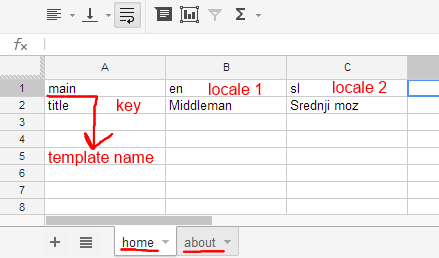

# MiddleDrive

## Quick start

```bash
gem install middleman
middleman init new_site
```

To `Gemfile` in `new_site` add `middle_drive`

```
gem 'middle_drive'
```

Then run

```bash
cd new_site
bundle
middle_drive init
```

## Manual install

```bash
gem install middle_drive
```

## Setup

### Middleman setup

```bash
middle_drive init
```

### Google drive setup conventions

- create a new collection in your google drive. Name it the same like in `middle_drive.yml`'s `site.collection` value.
- create google spreadsheet named `pages` inside this `site.collection`
  - each tab in this spreadsheet represents a page
  - value in first row and first column represents a template which will be used by middleman

- create google spreadsheet named `data_:language` inside `site.collection`
  - each tab in this spreadsheet represents different list
  - first data cell represents template and data type (template:data_type). Supported data types are `array`, `hash` and `list`.

- use protected ranges to prevent customer changing the structure of pages: https://support.google.com/drive/answer/63175


## Quick helpers

### Hash

```erb
<section class="article">
  <h3><%= d(locals).title %></h3>
  <%= d(locals).content %>
  <%= image_tag d(locals).image %>
</section>
```

### List

```erb
<% d(locals).each do |post| %>
  <h2><%= post.title %></h2>
  <%= post.content %>
  <span><%= post.date %></span>
<% end %>
```

## Usage

```bash
middle_drive
```

This command will sync images and page information from your Google Drive collection which was set in
`middle_drive.yml` file.

```bash
middle_drive update
```

Will search for update spreadsheet inside collection. If first A1 column will include `please update` value it will
sync all other data and clear up update flag. This is useful for circular checking if there are new updates to be
fetched.

## TODO
- tests!
- when building from scratch it would be better to start building `pages.yml`, `data.yml`, `en.yml` files locally
and then run init to build structure on google drive
- http://tvaughan.github.io/middleman-deploy/ + https://github.com/javan/whenever to run middle_drive update
